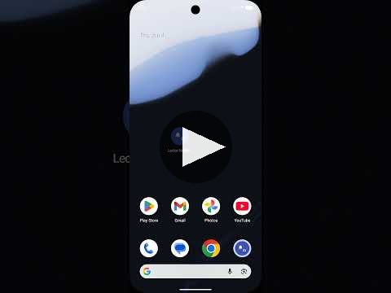

# Notification Reader


An Android app that captures system notifications and FCM push messages, stores them encrypted in Firebase Realtime Database, and lets trusted users monitor them in real time from their own device.

<div align="center">
  <a href="https://www.youtube.com/shorts/cFlfsc83GTk">
    
  </a>
  <br/>
  <b>▶ Promo video</b>
</div>

## Why you need it? - Never miss a thing

Left your phone at home? No problem. Notification Reader syncs your notifications to Firebase in real time, so you can access them from any authorised device or from the web app, without missing anything important while you're away.

## What it does

- **Captures notifications** from all apps on the device using Android's `NotificationListenerService`.
- **Receives FCM push messages** in foreground, background, and terminated states.
- **Stores everything encrypted** under `users/{uid}/notifications/` in Firebase Realtime Database using AES-256-GCM.
- **End-to-end encryption**: notification content is encrypted on the device before it reaches Firebase. Authorised viewers decrypt it locally using a key shared via RSA-2048-OAEP wrapping — the server never sees plaintext.
- **Shares access** with other users via a consent-based request flow — no access is granted without explicit approval.
- **Lock-screen playback**: a persistent foreground notification lets you trigger text-to-speech readout of pending notifications directly from the lock screen.
- **Sound alerts**: the Viewer tab plays a chime when new notifications arrive (configurable in Settings).
- **Persistent viewer state**: the last monitored user is remembered across app restarts — no need to re-enter the email after closing the app.

---

## Modes

### Monitor mode

This is your own device acting as the notification source.

1. Sign in with your email and password.
2. On the **Monitor** tab, grant notification access when prompted. This opens Android's system settings — find the app and enable the toggle.
3. Once granted, the lock-screen service starts automatically. A persistent notification appears; tapping **"Leer notificaciones"** reads your current notifications aloud via text-to-speech.
4. All captured notifications appear in the list below. Swipe left on any entry to delete it, or tap the sweep icon to clear all.
5. To revoke notification access, tap **Revoke permission** — this reopens the system settings where you can disable the toggle.

### Viewer mode

This lets you monitor another user's notifications, with their consent.

1. Sign in with your email and password.
2. Tap the **Viewer** tab.
3. Enter the email address of the user you want to monitor and tap **Send request**.
4. The other user will see your request in their **Requests** screen (bell icon, top-right). They must tap **Accept**.
5. Once accepted, their notifications appear in real time on your screen. Swipe left on any entry to delete it, or tap the sweep icon to clear all.
6. A chime plays when a new notification arrives while you are on a different tab. You can disable this in **Settings → Sound on new notification**.
7. The app remembers which user you were monitoring — if you close and reopen the app, it restores the connection automatically.
8. If the owner later taps **Revoke access** in their Requests screen, your viewer will immediately stop showing their notifications.
9. After a rejection or revocation, you can search for the same user again to send a new request.

---

## Requests screen

Accessible via the bell icon in the top-right corner of the Monitor tab. Here you can:

- **Accept** or **Reject** incoming access requests.
- **Revoke access** from users you previously accepted.

---

## End-to-end encryption

All notification content (`appName`, `title`, `body`) is encrypted on the device before being written to Firebase, using AES-256-GCM with a per-device key. The encrypted format is `ENC:<iv_base64>:<ciphertext_base64>`. Plain values (no `ENC:` prefix) are treated as legacy/unencrypted and passed through unchanged.

### Key sharing with viewers

When an owner accepts a viewer request, they fetch the viewer's RSA-2048 public key from `users/{viewerUid}/profile/publicKey`, wrap their own AES key with it (OAEP padding), and store the result in `users/{ownerUid}/incoming_requests/{viewerUid}/wrappedKey`. The viewer downloads and unwraps the key locally using their RSA private key. Revoking access deletes `wrappedKey` from Firebase, and the viewer's locally cached copy is discarded.

### Key storage

| Where | What |
|---|---|
| `SharedPreferences` (Flutter) | AES-256 key, RSA-2048 key pair, remote AES keys indexed by owner uid |
| `SharedPreferences` (Android) | AES-256 key (passed from Flutter via MethodChannel on startup) |
| `users/{uid}/profile/publicKey` | RSA public key — readable by any authenticated user |

---

## Database security rules

Rules are defined in [`database.rules.json`](database.rules.json) and referenced in `firebase.json`. Deploy them with:

```bash
firebase deploy --only database
```

| Path | Read | Write |
|---|---|---|
| `users/{uid}/profile` | owner only | owner only |
| `users/{uid}/profile/publicKey` | any signed-in user | owner only (inherited) |
| `users/{uid}/notifications` | owner or accepted viewer | owner or accepted viewer (delete) |
| `users/{uid}/incoming_requests/{requesterUid}` | owner or requester | owner or requester |
| `user_lookup/{emailKey}` | any signed-in user | any signed-in user (value must equal `auth.uid`) |

Key constraints enforced server-side:
- A requester can only write `status: "pending"` or `status: "rejected"` on their own request — they cannot self-grant `"accepted"`.
- `user_lookup` entries can only map an email key to the writer's own uid, preventing email hijacking.
- Notification access for viewers is derived at read-time from the owner's `incoming_requests` node, so revoking access takes effect immediately without any client-side coordination.
- `publicKey` is explicitly readable by any authenticated user so viewers can receive an encrypted AES key when a request is accepted.

---

## Firebase setup

Required before first run:

```bash
npm install -g firebase-tools
dart pub global activate flutterfire_cli

firebase login
flutterfire configure   # generates lib/firebase_options.dart and google-services.json
flutter pub get
```

In Firebase Console, enable:
- **Authentication** → Email/Password
- **Realtime Database** → create a database (test mode for development)

## Running the app

```bash
# Run on a connected Android device
flutter run

# Run on a connected Android device in release mode
flutter run --release
```

## Release builds

### Android — build and install APK

```bash
# Build release APK
flutter build apk --release

# Install it directly on a connected device (no Play Store needed)
adb install build/app/outputs/flutter-apk/app-release.apk
```

The APK is unsigned by default. To sign it for distribution, configure a keystore in `android/key.properties` and reference it in `android/app/build.gradle.kts` before building.

### macOS

```bash
# Build release app bundle
flutter build macos --release

# The .app is at:
# build/macos/Build/Products/Release/<AppName>.app
```

To distribute outside the Mac App Store, notarize the bundle with `xcrun notarytool` after building.

### Web — build and deploy to Firebase Hosting

```bash
# Build the web release
flutter build web --release

# Deploy to Firebase Hosting (site: notifierme)
firebase deploy --only hosting
```

The app will be live at the Firebase Hosting URL for the `notifierme` site. To deploy hosting and database rules together:

```bash
firebase deploy --only hosting,database
```

> iOS is partially supported (Firebase auth and FCM work), but notification capture requires Android's `NotificationListenerService` and is not available on iOS.
